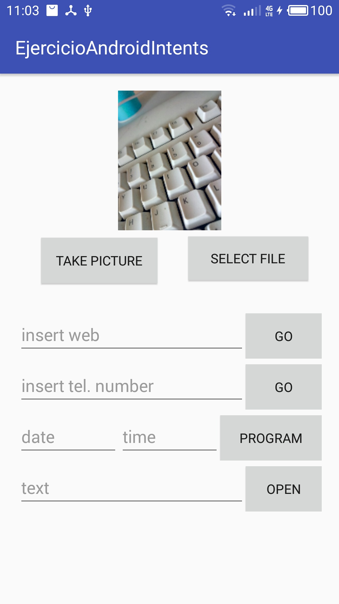

<h1>Ejercicios</h1>

<h2>Modelado de Bases de datos</h2>

https://drive.google.com/file/d/1w-xv9NK4YOWnf9cHrxrrlDrrK-2lKB0o/view?usp=sharing

<h2>Android Intents</h2>

https://github.com/cettorre/ExAndroidIntents

  

<h2>Android SQLite Database</h2>

https://github.com/cettorre/AndroidSQLiteDB

  

 
 

